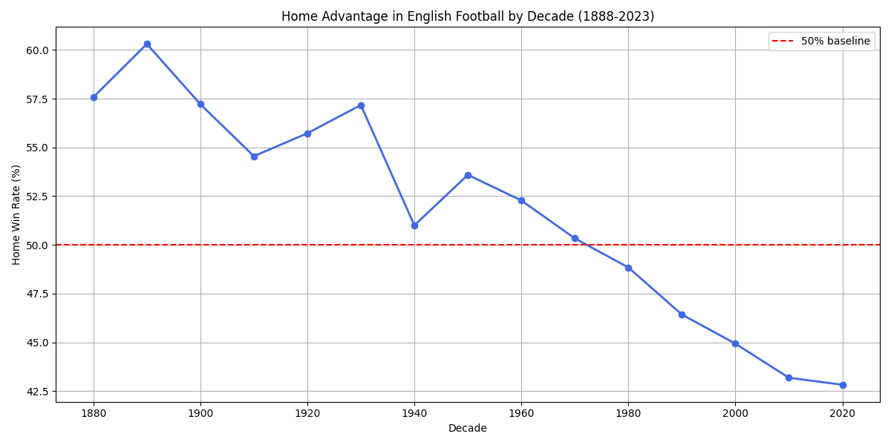

# English Football Home Advantage Analysis 🏴󠁧󠁢󠁥󠁮󠁧󠁿

## Overview
Exploratory data analysis of 130 years of English football data (1888–2023), 
uncovering scoring trends, home advantage decline, and data quality insights 
across 208,028 matches.

## Key Finding

Home win rates have been in persistent decline since the 1960s. No recovery, 
no plateau, just a continuous drop. The 1992 Premier League era appears to be 
the critical inflection point.

## Hypothesis
Three factors driving the decline:
1. **Atmosphere degradation**: rising ticket prices have priced out loyal 
   match-going fans, hollowing out home atmosphere
2. **Commercialisation**: tourist fans filling seats don't generate the same 
   intimidation factor as diehard supporters
3. **Away fan quality**: supporters willing to travel are diehards by 
   definition, improving relative away atmosphere simultaneously

## Other Findings
- **25.2% of all matches end in a draw**: consistent across eras
- **Tranmere 13-4 Oldham (1935)**: highest scoring game in 130 years
- **Data quality issue**: subdivision column has 179,062 missing values 
  (86% of dataset), flagged for further investigation

## Methodology
- Loaded raw CSV data directly from GitHub using Pandas
- Performed exploratory data analysis — shape, nulls, descriptive statistics
- Created a new `total_goals` column by combining home and away scores
- Grouped matches by decade and calculated mean home win rate per decade
- Visualised trend using Matplotlib

## Tech Stack
- Python 3.9
- Pandas
- Matplotlib

## Next Steps
- Correlate home advantage decline with Premier League era (post-1992)
- Investigate missing subdivision data
- Analyse scoring trends by division tier
